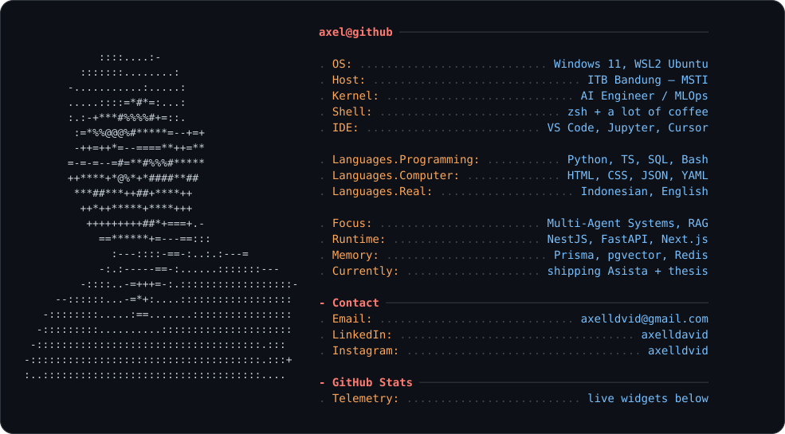

<div align="center">




</div>

<br/>

### `$ git log --graph — commit telemetry`

<div align="center">

</div>

<table width="100%">
<tr>
<td width="33%" valign="top">

### `$ streak --current`


</td>
<td width="33%" valign="top">

### `$ du -sh langs/*`


</td>
<td width="34%" valign="top">

### `$ uptime --hours`


</td>
</tr>
</table>

### `$ snake --eat contributions`

<div align="center">

</div>

---

### `$ cat CHANGELOG.md`

```diff
+ v2.4.0  thesis      multi-agent tax intelligence system — 7-agent architecture drafted
+ v2.3.0  kawanai      shipped scroll-driven storytelling redesign for kawanai.id
* v2.2.0  asista       rewrote core PRD — introduced channel-hub microservice + unified order queue
+ v2.1.0  hackathon    designed BAHARI — coastal cooperative commodity platform
* v2.0.0  research     applied PPDAC + XGBoost pipeline for financial distress detection
+ v1.0.0  init         started M.S. Information System & Technology @ ITB Bandung
```

---

### `$ ls /usr/bin/skills`

<div align="center">

</div>

---

### `$ spotify --recently-played`

<div align="center">

</div>

---

<div align="center">

### `$ ping axel`

[](mailto:axelldvid@gmail.com)
[](https://linkedin.com/in/axelldavid)
[](https://instagram.com/axelldvid)

<br/>


<br/><br/>

<sub><i>"turning data into information, and information into insight."</i></sub>

</div>

<!-- hero card: assets/axel-fetch.svg (hand-crafted, edit directly) · snake: .github/workflows/snake.yml → `output` branch · summary cards: profile-summary-card-output/ on main · refresh every 12h -->
