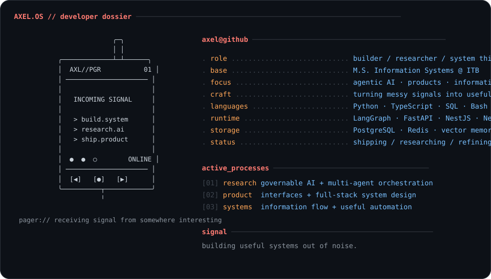

<div align="center">



</div>

<br/>

## `/boot`

```bash
axel@github:~$ whoami
builder / researcher / system thinker

axel@github:~$ mission
turning messy signals into useful systems, products, and insight
```

> M.S. Information System & Technology @ ITB Bandung  
> Building agentic systems, digital products, and information systems that move beyond demos.

---

## `/now`

<table width="100%">
<tr>
<td width="33%" valign="top">

### `01 / research`
Exploring governable AI, multi-agent orchestration, and practical intelligence systems.

</td>
<td width="33%" valign="top">

### `02 / building`
Turning product ideas into interfaces, backend systems, flows, and deployable software.

</td>
<td width="34%" valign="top">

### `03 / exploring`
Finding structure inside messy data, processes, and real-world operational problems.

</td>
</tr>
</table>

---

## `/selected-builds`

<table width="100%">
<tr>
<td width="50%" valign="top">

### `PANDU`
**Agentic curriculum intelligence**

A multi-agent system for helping lecturers structure curriculum, RPS, assessment analysis, and learning-cycle decisions.

`LangGraph` `Python` `Streamlit` `SQLite`

</td>
<td width="50%" valign="top">

### `ASISTA`
**Service orchestration as a product**

Designing clearer service journeys, unified operational flows, and systems that make fragmented processes feel coherent.

`Product Engineering` `System Design` `UX`

</td>
</tr>
<tr>
<td width="50%" valign="top">

### `RESEARCH // THESIS`
**Governable Agentic AI**

Researching how multi-agent systems can remain useful, auditable, controllable, and human-governed in public-facing digital systems.

`Agentic AI` `HITL` `Governance` `Information Systems`

</td>
<td width="50%" valign="top">

### `SIDE QUESTS`
**Experiments that refuse to stay small**

Personal products, interfaces, data experiments, AI workflows, infrastructure, and whatever problem looks interesting enough to prototype.

`build → break → learn → rebuild`

</td>
</tr>
</table>

---

## `/field-notes`

```text
[001] useful > impressive
[002] architecture is a product decision
[003] automation should remove friction, not remove agency
[004] good systems make complexity disappear without hiding responsibility
[005] if an idea can become a prototype, I will probably build it
```

---

## `/stack`

```text
thinking/
├── systems design
├── product engineering
├── agentic workflows
├── data-driven reasoning
└── human-centered AI

shipping/
├── Python
│   ├── LangGraph
│   ├── FastAPI
│   └── data / ML workflows
├── TypeScript
│   ├── Next.js
│   └── NestJS
├── PostgreSQL
├── Redis
├── Docker
└── Linux / WSL
```

---

## `/telemetry`

<div align="center">

</div>

<br/>

<div align="center">

</div>

---

## `/off-screen`

```text
♫  music in the background
⌁  interfaces that feel unusually good
◇  systems, infrastructure, AI, and too many side projects
↳  occasionally turning random curiosity into an entire product
```

---

## `/connect`

<div align="center">

[](mailto:axelldvid@gmail.com)
[](https://linkedin.com/in/axelldavid)
[](https://instagram.com/axelldvid)

<br/><br/>


<br/><br/>

<sub><i>AXEL.OS // building useful systems out of noise.</i></sub>

</div>

<!--
AXEL.OS
hero: assets/axel-os.svg
telemetry: github-readme-activity-graph + profile-summary-card-output
intentionally kept external widgets minimal to preserve a handcrafted profile identity
-->
